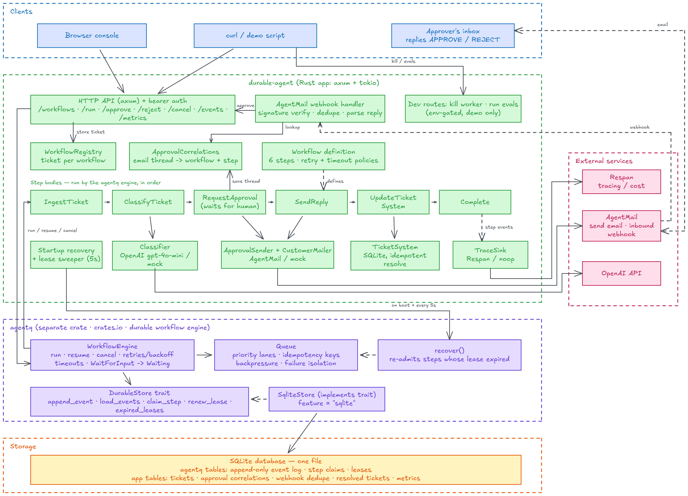

# durable-agent

A reference application for [agentq](https://github.com/Arshdeep54/agentq), a
durable workflow engine for Rust that runs as a library: no server, just a
SQLite file.

durable-agent runs an AI support-ticket workflow end to end. It classifies a
ticket with an LLM, waits for a human to approve the drafted reply by email,
sends it, and resolves the ticket. If the process crashes at any point, the
workflow resumes where it stopped.



## Workflow

| Step | What it does |
|---|---|
| IngestTicket | Records the incoming ticket |
| ClassifyTicket | Classifies the ticket and drafts a reply (OpenAI `gpt-4o-mini`) |
| RequestApproval | Emails the approver and waits for their reply (AgentMail) |
| SendReply | Sends the approved reply to the customer |
| UpdateTicketSystem | Marks the ticket resolved |
| Complete | Finishes the workflow |

## Features

- **Crash recovery:** steps are recorded in an event log, so a restarted
  worker resumes from the last completed step instead of starting over.
- **Human in the loop:** a workflow can wait for approval for seconds or days
  without holding a thread or memory.
- **Retries and timeouts:** each step has its own retry policy, with
  exponential backoff, and its own timeout.
- **Observability:** every step, including the LLM call's tokens and latency,
  is traced in Respan.

Steps are delivered at least once. See [DEVELOPMENT.md](DEVELOPMENT.md#reliability-semantics)
for the exact guarantees.

## Quick start

```sh
cargo run
```

Open http://127.0.0.1:8080. With no API keys set, the LLM, email and tracing
integrations are mocked, so everything runs locally. To use the real services,
set the variables described in [DEVELOPMENT.md](DEVELOPMENT.md#environment-variables).

## Using agentq

```toml
[dependencies]
agentq = { version = "0.2.1", features = ["sqlite"] }
```

## Documentation

- [DEVELOPMENT.md](DEVELOPMENT.md): configuration, local walkthrough, crash
  demo and reliability semantics
- [WORKFLOW.md](WORKFLOW.md): workflow design
- [DEPLOYMENT.md](DEPLOYMENT.md): deployment

## License

MIT. See [LICENSE](LICENSE).
